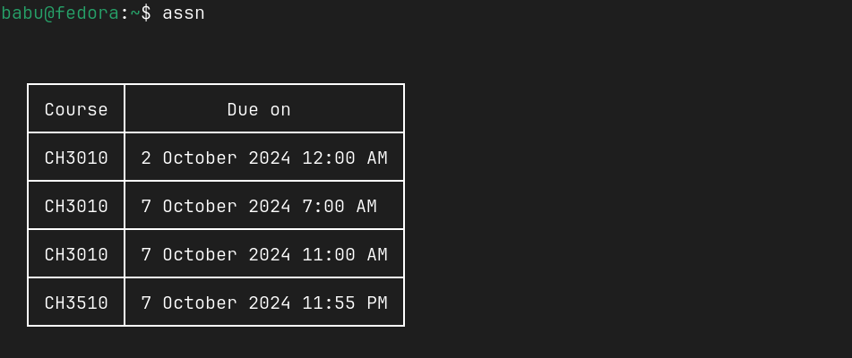

# Sample usage:

# Requirements

- `nodejs`: install with your package manager

- `puppeteer` and `tty-table`: install with npm, which comes along with nodejs, using `npm i puppeteer tty-table`

# Setup

- Clone into repository `pushd ~; git clone https://github.com/gnshb/assn-cli .assn-cli; popd;`

- Link the script: `sudo ln -s ~/.assn-cli/assn /usr/local/bin/`

- Setup credentials: `sh ~/.assn-cli/init.sh 'username' 'password'`

Note: make sure to escape double quotes when you setup your password with a backslash `\`. If your password has single quotes, use double quotes to enclose it.
